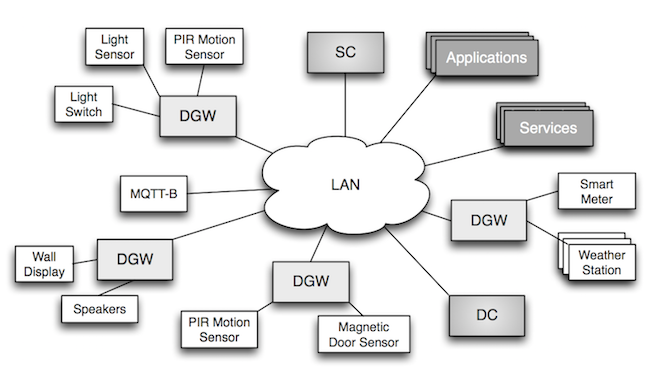
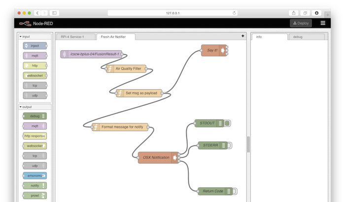

+++
title = "Patchwork Toolkit - Lightweight Platform for the Network of Things"
date = 2014-12-02T18:00:00Z
author = ["Alexandr Krylovskiy", "Oleksandr Lobunets"]
+++

# Motivation
<!--
*  Device integration: access to hardware resources via over the network (e.g., smart home/office scenarios)
*  Applications: discovery and communication with devices/resources
*  Patchwork toolkit: integration through configuration
*  Basic principles: KISS, DRY
-->
The Internet of Things (IoT) is on the verge of its hype all over the Internet, further boosted by the maker movement and device renaissance. However, implementing even basic smart home/office IoT scenarios today is still challenging. The first and arguably the main challenge is what is typically referred to as *Device Integration*: connecting IoT devices (sensors, actuators) to the network and providing access to them for applications using common APIs and protocols.

The IoT devices market is growing, and it is very simple to build your own "sensor platform" for under $100 using a Raspberry Pi and a handful of [sensors](http://www.adafruit.com/categories/35). You don't even need to know much about hardware to get started: following the [guides](https://learn.adafruit.com/category/raspberry-pi) and projects done by other people you can build a blinking prototype in just a few hours. In fact, you don't even need to know much about the software development for embedded devices either: the same [guides](https://learn.adafruit.com/category/raspberry-pi) walk you step-by-step through the process and provide with simple python examples and there are [libraries](https://github.com/adafruit/Adafruit-Raspberry-Pi-Python-Code) that make such prototyping very simple.

Once you have things working locally though, you start running into troubles: how to expose these devices on the network? how to discover and access them to build web/mobile applications to monitor and actuate things? At this point, you basically have two options:

1. Hack a simple web/ws server and/or setup an [MQTT](http://mqtt.org) broker and publish to it
2. Find and integrate using an existing IoT framework/toolkit

Without going into much details, we got tired of doing #1 over and over again, and couldn't find #2. That would satisfy our expectations in being *simple*, *lightweight*, *easy to deploy and work with*. With these goals in mind, we started creating [Patchwork](http://patchwork-toolkit.github.io/) - a lightweight toolkit for IoT development that offers integration of devices through configuration and provides basic services for discovery of resources and services on the network. And Go was the technology of our choice that helped us quickly create prototypes, evaluate them, rewrite and test them again, and finally roll out the first version ready for publicity.

# Architecture

## DGW for device integration

 * Process manager: management of agents and stdin/stdout redirection
 * Comm services: routing/proxying of requests and data streams
 * Extensible protocols, currently implemented: REST, MQTT

 
## Discovery: devices/resources and services

TBD...

# Implementation

## Technology evaluation

 * Flaws in java, python solutions
 * Why Go:
  * concurrency for process management
  * static linking (deployment on pocket-size computers)
  * cross-platform builds
  * performance
  * productivity
 * fun

## Highlights
* JSON configs
* Channels and diverse concurrency patterns
* Process management from forego
* Standard library
 * `net/http` implements most of the required functionality, only `gorilla/mux` router and `codegangsta/negroni` middleware for future extensions
 * `crypto/tls` surprisingly easy to use TLS (for MQTT)
 * Network stack for implementing (m)dns(-sd)
* `godep` for dependency management and vendoring
* Simple logging from multiple modules with `log`

# Usage example

## Dashboard out of the box

## Quick prototyping using IBM's NodeRed

# Summay

Future work