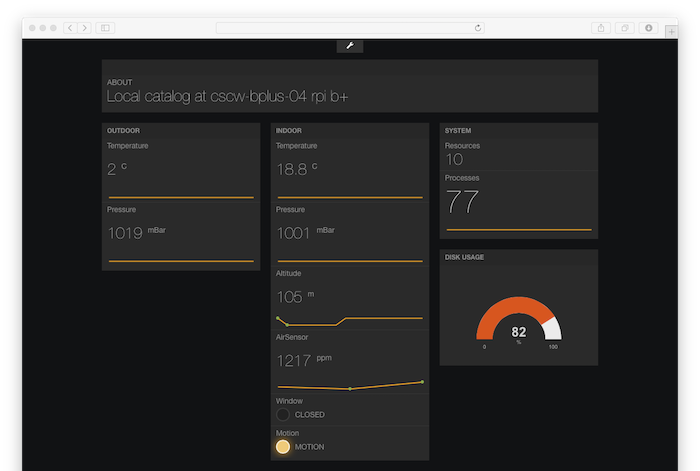

+++
title = "Patchwork Toolkit - Lightweight Platform for the Network of Things"
date = 2014-12-02T18:00:00Z
author = ["Alexandr Krylovskiy", "Oleksandr Lobunets"]
+++

# Motivation
*  Device integration: access to hardware resources via over the network (e.g., smart home/office scenarios)
*  Applications: discovery and communication with devices/resources
*  Patchwork toolkit: integration through configuration
*  Basic principles: KISS, DRY

# Architecture

## DGW for device integration

 * Process manager: management of agents and stdin/stdout redirection
 * Comm services: routing/proxying of requests and data streams
 * Extensible protocols, currently implemented: REST, MQTT

 
## Discovery: devices/resources and services

TBD...

# Implementation

## Technology evaluation

 * Flaws in java, python solutions
 * Why Go:
  * concurrency for process management
  * static linking (deployment on pocket-size computers)
  * cross-platform builds
  * performance
  * productivity
 * fun

## Highlights
* JSON configs
* Channels and diverse concurrency patterns
* Process management from forego
* Standard library
 * `net/http` implements most of the required functionality, only `gorilla/mux` router and `codegangsta/negroni` middleware for future extensions
 * `crypto/tls` surprisingly easy to use TLS (for MQTT)
 * Network stack for implementing (m)dns(-sd)
* `godep` for dependency management and vendoring
* Simple logging from multiple modules with `log`

# Usage example

## Dashboard out of the box

## Quick prototyping using IBM's NodeRed

# Summay

Future work