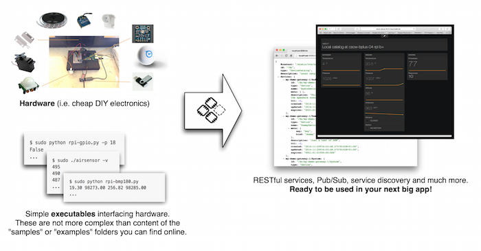
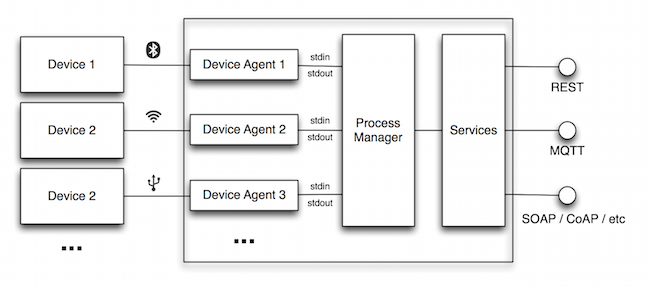
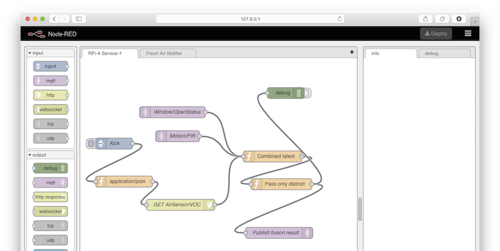

+++
title = "Patchwork Toolkit - Lightweight Platform for the Network of Things"
date = 2014-12-02T18:00:00Z
author = ["Alexandr Krylovskiy", "Oleksandr Lobunets"]
+++

[Patchwork](http://patchwork-toolkit.github.io/) is a toolkit for connecting various devices into a network of things or, in a more broad case - Internet of Things (IoT). The main goal of creating this toolkit is to have a lightweight set of components that can help to quickly integrate different devices (e.g. Arduinos, RaspberryPI’s, Plugwise, etc) into a smart environment and expose specific devices’ capabilities as RESTful/SOAP/CoAP/MQTT/etc services and data streams.

# TL; DR;

Briefly, what that all above and especially further in this article means is shown on the image below.

What the Patchwork toolkit is all about can be expressed simple like this (considering you as a hacker/hobbyist): you take your favourite electronics (bunch of sensors, LED strip, robot-toys, etc), connect them to a pocket-size Linux box, install Patchwork, do some quick configuration and you get RESTful API, data streams using MQTT, directory of your services, discovery in the LAN using Bonjour and _a damn-sexy, open source real-time dashboard_ based on [Freeboard](https://github.com/Freeboard/freeboard). 

All you need is your creativity and just focusing on the implementation of your **idea, not infrastructure!**

# Why
<!--
*  Device integration: access to hardware resources via over the network (e.g., smart home/office scenarios)
*  Applications: discovery and communication with devices/resources
*  Patchwork toolkit: integration through configuration
*  Basic principles: KISS, DRY
-->
 
The Internet of Things (IoT) is causing a hype all over the Internet, yet implementing even basic IoT scenarios like smart home/office today is still challenging. One of the main challenges is to connect IoT devices (sensors, actuators) to the network and provide access to them for applications using common APIs and protocols.

<!--You don't even need to know much about embedded hardware to get started: following the [guides](https://learn.adafruit.com/category/raspberry-pi) and projects done by other people you can build a blinking prototype in just a few hours. In fact, you don't even need to know much about programming for embedded devices either: the same [guides](https://learn.adafruit.com/category/raspberry-pi) will walk you step-by-step through the process and provide with simple python examples and [libraries](https://github.com/adafruit/Adafruit-Raspberry-Pi-Python-Code) that make such prototyping very easy.-->

The IoT devices market is growing, and it is very simple to build your own "sensor platform" for under $100 using a Raspberry Pi and a handful of [sensors](http://www.adafruit.com/categories/35). Once you have things working locally though, you start running into troubles: how to expose these devices on the network? how to discover and access them to build web/mobile applications to monitor and actuate things? At this point, you basically have two options:

1. Write a simple web/ws server and/or setup an [MQTT](http://mqtt.org) broker and publish to it (and hardcode endpoints)
2. Find an existing IoT framework/toolkit and integrate your devices/applications with it

Without going into much details, we got tired of doing 1. over and over again, and couldn't find 2. that would satisfy our expectations in being **simple**, **lightweight**, **easy to deploy and work with**. With these goals in mind, we started creating [Patchwork](http://patchwork-toolkit.github.io/) - a lightweight toolkit for IoT development that offers integration of devices through configuration and provides basic services for zeroconf discovery of resources and services on the network.

# Architecture

## Overview
A bird's-eye-view of the Patchwork architecture is shown in the picture:

Patchwork integrates devices, applications and services with the help of the following components:

* **Device Gateway (DGW)** integrating different IoT devices and exposing their resources on the network via common APIs (REST, MQTT)
* **Device Catalog (DC)** providing a registry of available IoT devices and their capabilities on the network
* **Service Catalog (SC)** providing a registry of available services (MQTT broker, Device Catalog, DB, ...) on the network
 
## Device Gateway

<!--* Process manager: management of agents and stdin/stdout redirection
* Comm services: routing/proxying of requests and data streams
  * Extensible protocols, currently implemented: REST, MQTT
-->
A high-level architecture of the DGW capturing its main modules is shown in the picture:

* **Devices** are IoT devices connected to the DGW host and communicating using their native protocols (Serial, ZigBee, etc) with Device Agents
* **Device Agents** are small programs running on the DGW and communicating through *stdin/stdout* with the Process Manager
* **Process Manager** manages the Device Agents (system processes) and forwards data between them and the communication Services
* **Services** expose the devices managed by Device Agents via common APIs (REST/MQTT) and forward requests/responses and data streams to the applications

Device agents for Patchwork can be implemented in any programming language suitable for integration of a particular device and [example agents](https://github.com/patchwork-toolkit/agent-examples) are provided. Having a device agent, the integration of a new device reduces to describing its capabilities and parameters to the agent and communication protocols in a json configuration file. Using this configuration, the DGW will register the device in the Device Catalog and expose its resources via configured APIs.

## Discovery of Devices and Services

In Patchwork, we distinguish between discovery of network services and IoT devices, which is implemented by the Device and Service catalogs correspondingly. The catalogs serve as registries for both Patchwork components and third-party applications and services and expose RESTful APIs.

Devices integrated with the DGW are automatically registered in its local Device Catalog, which can be used by applications to search for devices with required capabilities/meta-information integrated with that DGW. In addition to that, a network-wide Device Catalog can be configured on DGWs and populated with information about devices connected to them. 

Similarly, Service Catalog provides a registry of services running on the network, and can be used by applications to search for services by meta-information. For example, the network-wide Device Catalog can be registered in the Service Catalog to be discovered by applications.

To enable [zeroconf networking](http://en.wikipedia.org/wiki/Zero-configuration_networking) and discovery of services and IoT devices without manual configuration of the endpoints or IP addresses, we use [DNS-SD](http://dns-sd.org/) discovery and advertise the Service Catalog endpoint on the network. Having discovered the Service Catalog, applications can query it for available services and then search for devices by querying the discovered Device Catalog.

# Implementation

## Technology evaluation

* Flaws in java, python solutions
* Why Go:
 * concurrency for process management
 * static linking (deployment on pocket-size computers)
 * cross-platform builds
 * performance
 * productivity
 * fun

### Managing the processes with Go

One of the key goals of DGW was executing external programs, which should *talk* to the hardware resources using a low level (close to metal) interfaces and protocols and keep the communication with DGW using *stdin* and *stdout* streams. These external programs can be executed once upon request (task), periodically executed  (timer) or constantly running and producing output (service).

The idea of how to implement such process management came from [Foreman](http://ddollar.github.io/foreman/) - a Procfile-based applications manager. Luckily we found 2 ports of this great developer's tool to Go: [Forego](https://sourcegraph.com/github.com/ddollar/forego) and [Goreman](https://github.com/mattn/goreman). In fact we had the same requirement, but instead of using Procfile we had our JSON-based configuration and the processes had different types of execution.

### Communication between HTTP server and executables

Another challenge in creating DGW was how to implement request processing pipeline:
 1. RESTful API handler receives _HTTP GET_ request
 2. DGW resolves which agent is exposed under request's URI
 3. DGW invokes a corresponding executable (if it is a _task_) and captures its standard output stream or reads the latest cached value (if it is a _timer_ or a _service_)
 4. DGW returns the value (or an error) back to the HTTP request handler
 5. The handler composes and sends the HTTP response

Or another scenario, which is event more complex:
 1. RESTful API handler receives _HTTP PUT_ request, which requires changing the corresponding hardware resource state (using actuator rather than sensor)
 2. DGW resolves which agent is exposed under request's URI
 3. DGW invokes a corresponding executable (if it is a _task_) and writes received PUT data to its standard input stream, then captures its standard output stream or write to a standard input stream pipe with a running executable (if it is a _service_). We do not support writes for _timer_ agent types.
 4. The rest of the steps are similar as in the previous scenario.

## Highlights

* JSON configs
* Channels and diverse concurrency patterns
* Process management from forego
* Standard library
 * `net/http` implements most of the required functionality, only `gorilla/mux` router and `codegangsta/negroni` middleware for future extensions
 * `crypto/tls` surprisingly easy to use TLS (for MQTT)
 * Network stack for implementing (m)dns(-sd)
* `godep` for dependency management and vendoring
* Simple logging from multiple modules with `log`

# Usage example

## Dashboard out of the box

## Quick prototyping using IBM's NodeRed

# Summay

Future work